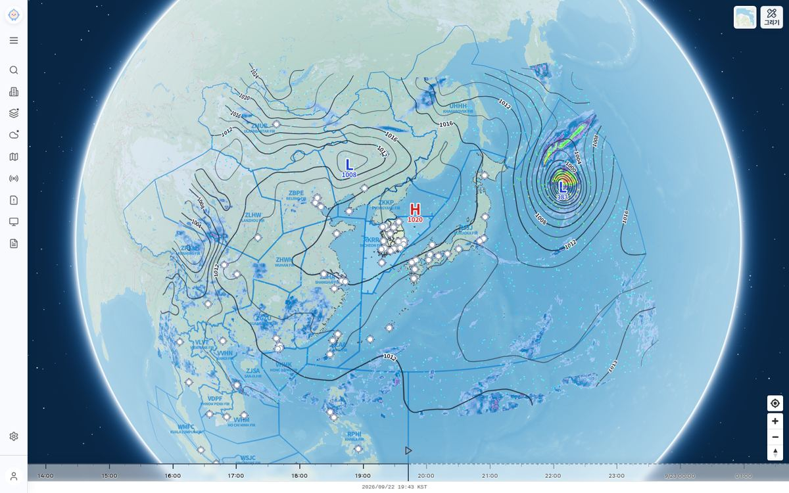
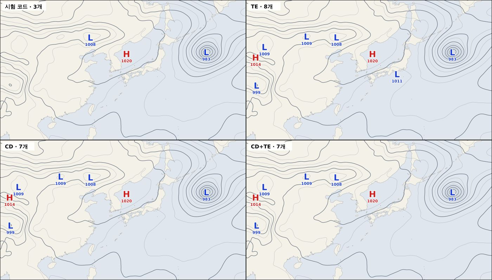
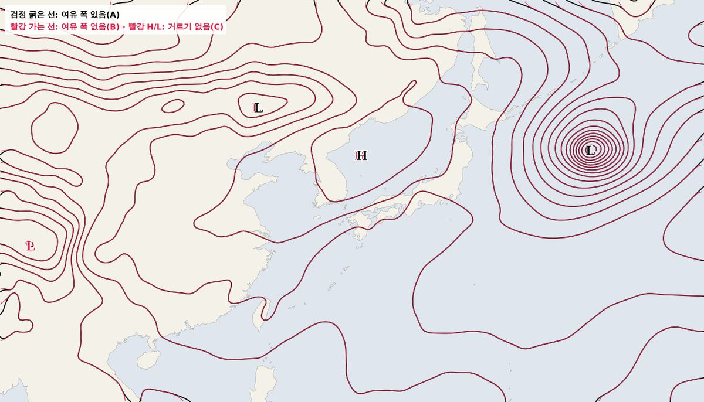
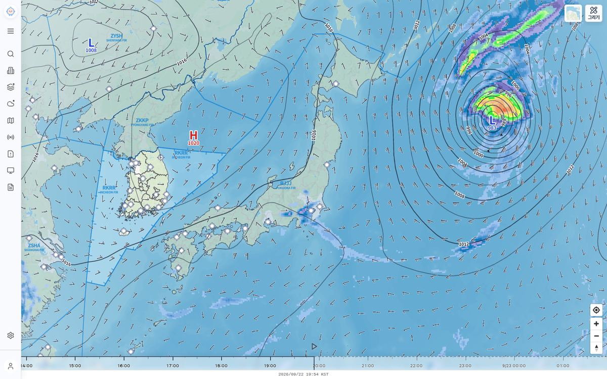
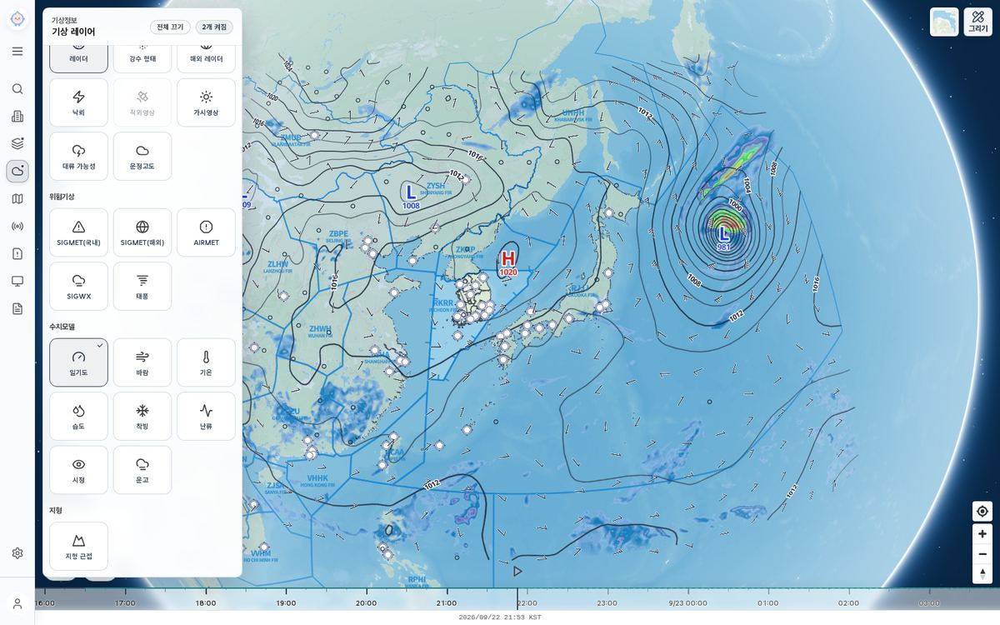

# KIM 지상 일기도 레이어 설계

2026-09-22. 날씨누리 수치모델 화면처럼 KIM 예상강수량, 등압선, 기압중심(H/L), 지상바람을 메인 지도에 겹쳐 보여 주는 MET 레이어 설계다. 같은 날 KIM 격자를 실제로 받아 개발 지도에 주입하는 시험을 마쳤고, 이 문서의 수치는 그 시험 결과를 따른다. 앱 코드는 아직 변경하지 않았다.

2026-08-14 설계(`docs/archive/development/specs/2026-08-14-surface-pressure-rain-chart-design.md`)는 KMA가 그린 일기도 이미지를 받아 덮는 방식이었고 구현되지 않았다. 이 문서는 그 설계를 대체한다. 이미지 대신 격자 값으로 직접 그려 확대해도 선명하고, 우리 지도 스타일과 타임라인에 맞출 수 있다.

## 범위

- 포함: 해면기압 등압선, H/L 중심과 중심기압, 3시간 예상강수량, 지상바람(입자 애니메이션과 바람깃).
- 제외: 전선, 기압골·능선 자동 분석, 상층 일기도, 5일 이상 장기 예보.
- 기존 KIM 바람·기온·습도·착빙 수집과 한반도 영역 바람 레이어는 바꾸지 않는다.

## 1. 수집

### 요청

기존 KIM 격자 API(`nph-kim_nc_xy_txt2_std`)를 그대로 쓴다. 기존 수집과 다른 점은 영역, 변수, 인증 키다(아래 "API 키 할당").

| 항목 | 값 |
| --- | --- |
| 변수 | `psl`(해면기압, Pa), `prec_acc`(모델 시작부터 누적강수, kg/m²), `u10m`, `v10m`(m/s) |
| 공통 | `group=KIMG`, `nwp=NE57`, `data=U`, `level=0`, `map=S`, `disp=A` |
| 격자 | 전구 1/12°. `sub=x1,y1,x2,y2`에서 x ≈ 경도×12, y ≈ (위도+90)×12 |
| 표시 영역 | 동경 95–165°, 북위 15–55° |
| 수집 영역 | 표시 영역보다 사방 6° 넓게: 동경 89–171°, 북위 9–61° (약 985×625칸, 한 장 약 8 MB) |
| 예보 시각 | 각 런의 +3, +6, +9, +12시간 |
| 런 | 00·06·12·18 UTC. 기존 KIM 공개 시각 규칙(약 +5시간부터 재시도)을 따른다 |

`prec_acc`는 모델 시작 시각에 0이므로 +3시간 값이 그대로 첫 3시간 강수량이다. 네 시각만으로 3시간 강수 네 장이 나온다.

API Hub 명세(2.1.2 일부 격자영역)상 격자 번호는 [1,1]부터 시작한다. 시험 헤더와 맞춰 보면 경도는 (x−1)/12로 정확히 맞고(x=1020 → 84.92°, 헤더 84.9), 위도는 (y−1)/12−90 = 4.92°인데 헤더는 5.0°라 반 칸(1/24°) 밀린 칸 중심 격자로 보인다. 구현할 때는 좌표를 헤더의 `lon1`·`lat1`·`i`·`j` 기준으로 정하고, 해안선에 대어 보는 회귀 테스트로 확정한다. 활용신청 대상은 API Hub의 "한국형수치예보모델(KIM) 표준화 자료 조회(NC)"이고, 레이더·위성 키 계정으로 신청한다.

### 호출량과 용량

| 항목 | 런당 | 하루(4런) |
| --- | --- | --- |
| 호출 | 16회(변수 4 × 시각 4) | 64회 |
| 다운로드 | 약 130 MB | 약 520 MB |
| 저장(결과물) | 약 4 MB | 최근 2런 보관 시 약 8 MB |

기존 KIM 수집(런당 수천 회)의 1% 미만이다. 원본 텍스트는 계산이 끝나면 지운다. KMA 서버가 압축 전송을 지원하는지 확인되면 다운로드는 더 줄어든다.

### API 키 할당

KMA API Hub 한도는 호출 수가 아니라 **키마다 하루 전송량 5 GB**다. 4.75 GB에 닿으면 `api-hub-usage`가 그 키의 수집을 막는다(`blockedReason: daily_budget`). 키는 세 개다.

| 키 | 지금 쓰는 곳 |
| --- | --- |
| `KMA_KIM_NWP_AUTH_KEY` | KIM 격자·KTG 00·06·12UTC 런 |
| `KMA_AVIATION_AUTH_KEY` | 항공·일반 자료 전체, KIM 격자·KTG 18UTC 런 |
| `KMA_RADAR_SATELLITE_AUTH_KEY` | 레이더·위성 그래픽 |

운영 사용량(2026-09-22 21:24 KST, 하루 초기화 00:00 KST). 관리자 화면은 한도 5,000,000,000 바이트를 4.66 GB(GiB)로, 차단 기준 4.75 GB를 4.42 GB로 표시한다. 일기도는 하루 약 0.48 GB(GiB)다.

| 키 | 21:24 사용량 | 하루 끝 예상 | 일기도 추가 시 | 차단 기준까지 여유 |
| --- | --- | --- | --- | --- |
| KIM NWP | 4.42 GB, **이미 차단됨** | — | 넣을 수 없음 | 없음 |
| 항공·일반 | 3.11 GB (지상 시정 1.53 GB, 18UTC KIM 격자 1.50 GB) | 약 3.30 GB | 약 3.78 GB | 약 0.65 GB |
| 레이더·위성 | 1.52 GB | 약 1.70 GB | 약 2.18 GB | 약 2.24 GB |

하루 끝 예상은 남은 2.6시간 동안 지상 시정(호출당 약 24.5 MB)과 레이더·위성이 지금 속도로 쓴다고 본 값이다.

**결정: 일기도는 네 런 모두 레이더·위성 키(`KMA_RADAR_SATELLITE_AUTH_KEY`)로 받는다.** 항공 키에 넣으면 METAR·TAF·경보가 있는 키의 여유가 0.65 GB로 줄어, 재시도나 지상 시정 증가 한 번에 핵심 항공 자료가 멈출 수 있다. 레이더·위성 키는 일기도를 더해도 절반 아래다.

- 수집기 등록 시 `apiHubCategories: ['radar_satellite']`로 선언해, 이 키가 차단 상태면 수집 전에 건너뛴다. 레이더·위성 수집을 끈 설정(`KMA_RADAR_SATELLITE_ENABLED=0`)에서는 일기도 수집도 끈다.
- 새 호출 종류 `kim_grid_chart`의 키 분류(`credentialCategory`)는 `radar_satellite`다. 기존 `kim_grid`는 `kim_nwp`로 분류되므로 둘을 구분하는 것이 여기서도 필요하다.
- 2026-09-22 확인: 레이더·위성 키로 활용신청 후 수집 영역(`sub=1069,1189,2053,1813`, 985×625칸) 기압 한 장을 받았다. HTTP 200, 8.07 MB, 0.85초. 같은 격자점 값이 KIM 키로 받은 자료와 일치했다.
- 별도 문제: KIM NWP 키는 이날 21:24에 이미 차단 기준에 닿았다. 기존 KIM 수집의 남은 런이 막힐 수 있으므로 일기도와 별개로 점검한다.

### 실패 처리

- 한 런의 16장이 모두 검증을 통과했을 때만 새 런으로 교체한다. 일부만 실패하면 이전 정상 런을 유지하고 다음 스케줄에서 재시도한다.
- 거부하는 응답: 격자 크기 불일치, `Variable not found`·`file is not exist`, 결측값(-99999) 비율 과다, 해면기압이 물리 범위(870–1090 hPa)를 벗어난 값.
- 인증 키는 URL, 메타데이터, 로그에 남기지 않는다.

### 스케줄과 관리자 화면 연동

독립 수집기 `kim_surface_chart`로 등록한다. 기존 `kim_surface_wind`에 끼워 넣지 않는다. 두 수집은 실패와 재시도를 따로 판정해야 하고, 관리자 화면에서도 따로 보여야 하기 때문이다.

스케줄(cron), 누락 감시, 관리자 `자료 수집` 화면, API 사용량 집계는 모두 수집기 등록부(`backend/src/collector-registry.js`)와 등록된 목록에서 자동으로 만들어진다. 다만 아래 목록 중 하나라도 빠지면 조용히 빠지는 구조라, 모두 함께 등록한다.

| 위치 | 할 일 | 빠지면 |
| --- | --- | --- |
| `backend/src/config.js` `schedule.kim_surface_chart_interval` | KIM 공개 시각 규칙과 같은 시각대(UTC 1·5·6·7·11·12·13·17·18·19·23시)로 두되, 분을 기존 KIM 수집(12분)과 겹치지 않게 뗀다. 예: `42 …` | 스케줄 없음 |
| `backend/src/collector-registry.js` | `collector('kim_surface_chart', utc('kim_surface_chart_interval', 6 * HOUR, 35 * MINUTE), 활성 조건, ['radar_satellite'])`. 활성 조건은 `config.kim_nwp.enabled`, 레이더·위성 키 존재, 새 설정 `kim_surface_chart.enabled`를 함께 본다 | cron 등록, 누락 감시(watchdog), 관리자 목록에서 빠짐 |
| `backend/src/index.js` | `processorBindings`와 `locks`에 추가. 서버 시작 시 수집(startup jobs)에도 넣는다 | 등록부 검사(`assertCollectorRegistry`)가 서버 시작을 막음 |
| `backend/src/stats.js` `TYPES` | 추가 | 성공·실패 기록이 유실됨(파일 주석에 과거 사례가 있다) |
| `backend/src/admin/data-health-catalog.js` | `{ key: 'kim_surface_chart', label: 'KIM 지상 일기도', source: 'kma_nwp', character: 'nwp', normalMs: h(6), lateMs: h(9), stoppedMs: h(18), meta: 'kim_surface_chart/latest.json', disabledWhen: … }` | 관리자 `자료 수집` 화면에 행이 없음 |
| `backend/src/api-operation-registry.js` | 새 호출 종류 `kim_grid_chart`(키 분류 `radar_satellite`)를 추가한다. 주소가 기존 `kim_grid`와 같은 `nph-kim…`이므로 요청의 `sub` 값(일기도 영역)으로 구분하고, 기존 `kim_grid`는 이 `sub`를 제외한다. 한 장 약 8 MB이므로 제한 시간은 60초, 재시도 1회로 따로 둔다 | 일기도 호출이 기존 KIM 수집 몫으로 집계되고, 30초 제한에 걸릴 수 있음 |
| `backend/src/dev/snapshot-store.js` | 활성 런 디렉터리의 캡처·복원·준비 점검 소유 등록 | 시연 스냅샷에서 일기도가 빠짐 |

- 관리자 `자료 수집` 화면(`DataCollectionScreen.jsx`)은 백엔드 `data-health` 응답의 행을 그대로 그린다. 위 카탈로그 행만 추가하면 화면 코드는 바꾸지 않아도 된다. 마지막 성공 시각, 상태(정상·지연·멈춤), 최근 오류, 관련 API 호출 결과가 함께 나온다.
- 관리자 화면에는 수집을 즉시 실행하는 버튼이 없다. 이 설계에서도 추가하지 않는다.
- 판정 기준은 기존 `KIM 수치예보 격자` 행과 같게 둔다. 6시간마다 새 런이 나오므로 9시간이면 지연, 18시간이면 멈춤이다.
- 검증: 등록부 테스트(활성·비활성 설정별 목록), 스케줄 테스트(`kim-scheduler.test.js` 방식), API 호출 분류 테스트(같은 주소에서 `sub`로 두 종류 구분), 카탈로그 행 존재 테스트.

## 2. 서버 계산

모든 계산은 수집 직후 서버에서 한 번 한다. 시험에서 한 시각의 계산은 1초 안팎이었다.

### 등압선

1. 해면기압을 3×3칸씩 평균해 0.25° 격자로 줄인다.
2. 등압선용 격자는 가우시안(σ 1.5°)으로 세게 평활화한다. H/L 판정은 따로 σ 0.5°를 쓴다. 등압선에 맞춰 세게 평활하면 동해 H 1020 같은 약한 중심이 사라지기 때문이다.
3. `@turf/turf`의 `isolines`로 2 hPa 간격 선을 만든다. 4 hPa 배수 선은 `major`로 표시한다.
4. 가로·세로 1.5°보다 작은 닫힌 등압선은 버린다.
5. 격자 칸마다 꺾인 모서리를 Chaikin 방식으로 두 번 다듬고, 늘어난 점은 0.01°(약 1 km) 오차 안에서 줄인다(한 시각 약 33 KB).
6. 표시 영역으로 잘라 GeoJSON으로 저장한다.

2026-09-22 화면 검토에서 σ 0.5° 등압선은 격자 요철을 따라 찌그러지고 작은 고리가 생겨, 날씨누리 수치모델 화면처럼 완만하게 바꿨다. 그 결과 약한 H/L은 둘러싸는 등압선 없이 기호만 보일 수 있다(날씨누리도 같다).

### H/L 중심

시험 코드가 쓴 규칙이다. 구현 기준은 바로 아래 근거 표를 따른다.

| 규칙 | 값 |
| --- | --- |
| 극값 판정 | 평활화한 0.25° 격자에서 반경 24칸(6°) 사각 창 안 최솟값(L) 또는 최댓값(H) |
| 닫힌 중심 | 창 테두리 전체가 중심보다 1 hPa 이상 높을 것(L). H는 반대 |
| 가장자리 | 탐색 창이 수집 영역 밖으로 나가는 후보는 버린다. 여유 폭이 6°이므로 표시 영역 전체에서 중심을 판정할 수 있다 |
| 중심기압 | 평활화 전 원자료(1/12°)에서 중심 주변 1° 안의 극값을 정수로 표시 |
| 표시 | 표시 영역 안의 중심만 저장 |

근거. 시험 코드는 특정 문헌을 따르지 않고 일반적인 방법으로 짰다. 구현은 아래 레퍼런스에 맞춘다.

| 단계 | 시험 코드 | 구현 기준 | 레퍼런스 |
| --- | --- | --- | --- |
| 등압선 간격 | 2 hPa, 4 hPa 굵게 | 그대로. 기본 4 hPa, 보조 2 hPa | WPC 표준 지상분석 매뉴얼: 4 hPa 기본, 기압경도가 약한 곳에 1–2 hPa 보조선 |
| 등압선 추출 | `@turf/turf` `isolines` | 그대로(marching squares) | CycloneDetector도 marching squares로 등압선을 뽑는다 |
| 평활화 | 상자 평균 2회 | 가우시안 평활화. 강도는 시험 결과와 비슷하게 맞춘다 | MetPy·Unidata H/L 예제 |
| 중심 후보 | 경위도 사각 창(반경 6°) 안 극값 | 안에 다른 닫힌 등압선이 없는 가장 안쪽 닫힌 등압선을 후보로 삼고, 면적(1만–2만 km²) 미만은 버리거나 바깥 등압선으로 올린다. 중심 위치는 그 안의 극값 | CycloneDetector(Prantl·Žák·Prantl) |
| 닫힌 중심 판정 | 창 테두리 최솟값이 1 hPa 높은지(대용) | 중심에서 채워 나가 대권거리 6° 안에서 기준값 이상 오르는 닫힌 등압선이 있는지 확인. 6° 안의 후보는 가장 강한 것 하나로 합친다. 기준값은 1 hPa로 시작한다. TempestExtremes 값(2 hPa)은 저기압 통계용이라, 이 시험에서 쓰면 동해 H 1020(깊이 1.5 hPa)이 빠진다 | TempestExtremes 온대저기압 기본값 `PSL,200.0,6.0,0`, `mergedist 6.0` |
| 표시 규칙 | H 빨강·L 파랑, 중심기압 표시 | 그대로. 닫힌 등압선이 최소 하나 있는 극값만 H/L로 표시하고 중심기압을 곁에 적는다. 표시 개수 상한을 둔다 | WPC 매뉴얼 H/L 정의, GEMPAK `HILO`(개수 상한 기본 20) |
| 고지대 | 처리 없음 | **표고 필터를 두지 않는다.** 고지대에 흩어지는 작은 가짜 중심은 CD 면적 필터로 거른다(2026-09-22 결정). 쓰촨·티베트 열저기압처럼 큰 닫힌 계는 남긴다 | CycloneDetector: 면적 필터가 히말라야·로키·안데스 위의 작은 계를 걸러 지형 필터가 필요 없다. IMILAST: 고지대 처리 표준 없음 |

레퍼런스
- WPC·OPC·NHC·HFO, Unified Surface Analysis Manual (2013-11-21). https://www.wpc.ncep.noaa.gov/sfc/UASfcManualVersion1.pdf
- Prantl, Žák, Prantl, CycloneDetector (v1.0) – Algorithm for detecting cyclone and anticyclone centers from mean sea level pressure layer, GMD Discussions (2021); 게재본 Journal of Spatial Science (2022), doi:10.1080/14498596.2022.2134221. https://gmd.copernicus.org/preprints/gmd-2021-266/
- Ullrich et al., TempestExtremes v2.1, Geosci. Model Dev. 14, 5023–5048 (2021). https://gmd.copernicus.org/articles/14/5023/2021/
- Unidata GEMPAK `HILO` 파라미터. https://unidata.github.io/gempak/man/parm/hilo.html
- Unidata MetPy `find_peaks`, High/Low Analysis 예제. https://unidata.github.io/MetPy/latest/api/generated/metpy.calc.find_peaks.html
- Neu et al., IMILAST, Bull. Amer. Meteor. Soc. 94, 529–547 (2013), doi:10.1175/BAMS-D-11-00154.1
- Wernli & Schwierz, Surface cyclones in the ERA-40 dataset, J. Atmos. Sci. 63, 2486–2507 (2006). 가장 바깥 닫힌 등압선으로 저기압 영역을 정의하는 방법

비교 시험(같은 시각, 날씨누리 화면과 같은 유효시각). 시험 코드는 태풍 L, 동해 H 1020, 만주 L 1008의 3개만 잡았다. 레퍼런스 방식(CD+TE, 닫힘 1 hPa·6°, 등압선 2 hPa, 면적 1만 km²)은 여기에 내몽골 L 1009, 몽골 서부 L 1009, 서쪽 H 1014, 쓰촨·티베트 경계 L 999를 더해 7개를 잡았고, 날씨누리 화면의 H/L 배치와 거의 같다. TE만 쓰면 날씨누리에 없는 일본 남쪽 L 1011이 더 생기고, CD 등압선 기준이 이를 거른다. 닫힘 기준을 2 hPa로 올리면 동해 H 1020(깊이 1.7 hPa)이 빠진다. 날씨누리에만 있는 중국 중부 L과 남부 H는 닫힘 깊이 0–0.4 hPa인 약한 극값으로, 날씨누리는 GEMPAK `HILO`처럼 창 안 극값을 그대로 찍는 것으로 보인다. 항공 브리핑에는 사람이 분석한 일기도에 가까운 쪽을 택한다.

### 여유 폭을 두는 이유

같은 자료를 표시 영역만큼 잘라 비교했다. 등압선은 맨 바깥 1° 띠에서만 최대 43 km 어긋났고 나머지는 사실상 같았다. 차이는 H/L에서 난다. 여유 폭이 없으면 탐색 창이 잘리는 가장자리 6° 안의 중심을 판정할 수 없어서, 화면 끝에 있는 태풍의 L이 빠진다. 반대로 잘린 창을 그대로 인정하면 경계에서 가짜 중심이 생긴다(시험에서는 티베트 고지대의 약한 L 하나).

가장자리 재확인(2026-09-22). 받은 넓은 자료에서 표시 영역만 옮겨, 태풍(153.7E 40.1N)이 동쪽 끝에서 1.3–2.3°, 북쪽 끝에서 1.9°, 동북 모서리에 오게 하고 여유 폭 0·3·6·10°로 CD+TE 판정을 비교했다.

| 경우 | 여유 0° | 3° | 6° | 10° |
| --- | --- | --- | --- | --- |
| 태풍 L 983 (깊이 약 19 hPa) | 잡힘 | 잡힘 | 잡힘 | 잡힘 |
| 북쪽 끝 2.4° 안의 동해 H 1020 (깊이 1.7 hPa) | 빠짐 | 빠짐 | 잡힘 | 잡힘 |
| 경계의 가짜 중심 | 없음 | 없음 | 없음 | 없음 |

강한 태풍은 1 hPa 등압선이 중심 1–2° 안에서 닫혀 여유 폭이 없어도 잡힌다. 여유 폭이 필요한 것은 가장자리 근처의 약한 계다. 닫히는 반경이 넓어 탐색이 수집 영역 밖으로 나가기 때문이다. 3°로는 부족하고 6°에서 회복되므로 **여유 폭 6°를 확정한다.** CD는 영역 경계에서 열린 등압선을 후보로 쓰지 않고 TE는 닫힘을 요구하므로, 여유 폭이 없어도 경계에 가짜 중심은 생기지 않았다.

### 3시간 강수

- `prec_acc(+N) − prec_acc(+N−3)`, 음수는 0.
- 원래 간격(1/12°)으로 색을 입혀 Web Mercator 위도 간격의 PNG로 저장한다. Mapbox 이미지 소스가 네 모서리 사이를 선형으로 펴기 때문에, 등간격 위도 그림을 쓰면 남북 방향으로 어긋난다.
- 색 단계(3시간 누적, mm). 색은 날씨누리 범례에서 뽑은 값이다. 숫자가 적힌 칸(3·10·20·30·40·60·80)은 확정값이고, 그 사이 칸 경계는 추정값이라 기상청 단계표로 교체한다.

| 이상 | RGB | 이상 | RGB | 이상 | RGB |
| --- | --- | --- | --- | --- | --- |
| 0.5 | 163,199,242 | 10 | 94,81,167 | 33 | 255,249,79 |
| 1 | 136,180,232 | 12 | 127,182,212 | 36 | 254,240,46 |
| 1.5 | 104,161,220 | 15 | 127,212,182 | 40 | 255,211,150 |
| 2 | 64,141,206 | 18 | 200,255,150 | 45 | 255,182,121 |
| 3 | 0,119,188 | 20 | 150,255,121 | 50 | 255,150,90 |
| 5 | 167,159,225 | 23 | 98,249,98 | 55 | 255,98,44 |
| 7 | 124,112,200 | 26 | 44,240,44 | 60 | 255,73,35 |
|  |  | 30 | 255,255,131 | 67 / 73 / 80 | 255,41,26 / 255,19,16 / 248,0,0 |

### 지상바람

u·v를 표시 영역의 0.25° 격자(281×161)로 줄여 기존 바람 필드 형식(`grid`, `u`, `v`)으로 저장한다. 시험에서는 1/12° 원래 간격(약 3.6 MB)으로 확인했다. 입자가 안 보이던 원인은 해상도가 아니라 이동 속도 설정이었으므로 0.25°(약 0.6 MB)로 충분하다고 보고, 구현 때 화면으로 확인한다.

## 3. 저장과 API

- 저장 위치: `DATA_PATH/kim_surface_chart/runs/<runId>/hfNNN/`. 시각마다 `isobars.json`, `centers.json`(둘 다 GeoJSON), `precip3h.png`, `wind.json`, 런마다 `manifest.json`(발표시각, 유효시각 목록, 표시 영역).
  - GeoJSON인데 확장자를 `.json`으로 둔 이유: 운영 nginx가 `/data/…​.geojson`을 프론트엔드 정적 파일(항공 GeoJSON) 규칙으로 보내 404가 된다.
- 발행: 새 런을 임시 폴더에 모두 쓴 뒤 이름을 한 번에 바꾸고, 그다음 `latest.json`을 원자적으로 바꾼다. 최근 2런만 보관한다.
- 최신 런 목록은 `GET /api/kim/surface-chart`(ETag, `no-cache`)로 내보낸다. nginx가 `/data/` 아래를 직접 내보내면 캐시 지시가 없어 브라우저가 옛 목록을 쥘 수 있기 때문이다. 시각별 파일은 런 폴더 경로가 바뀌므로 `/data/kim_surface_chart/runs/…`에서 바로 받는다.
- 캐시: 백엔드(`setGeneratedDataCacheHeaders`)와 nginx 예시 설정 모두 런 파일에 `immutable`을 붙인다. 운영 nginx에 이 규칙을 반영하지 않아도 동작은 같고, 캐시만 기본 동작을 따른다.
- 새 런 알림은 snapshot-meta의 `kimSurfaceChart.hash`로 한다.
- 시각은 UTC epoch ms로 저장하고, 표시는 기존 KST/UTC 설정을 따른다.
- 스냅샷 저장소(`snapshot-store`)가 `kim_surface_chart` 폴더째 캡처·복원한다. 기존 시연 스냅샷을 깨지 않도록 시연 필수 자료에는 넣지 않았다.

## 4. 지도 표시

### 조작

MET 패널 `수치모델` 묶음에 `강수` 타일(비 구름 아이콘)을 둔다. 기능 이름은 KIM 지상 일기도지만, 화면에서는 사용자가 찾는 이름인 `강수`로 부른다(2026-09-22 결정). 검색에서는 `지상일기도`·`일기도`·`등압선`으로도 찾을 수 있다. 켜면 등압선·기압중심과 3시간 예상강수가 함께 표시되고, 바람은 애니메이션과 바람깃 중 하나로 표시된다.

- 기본은 바람 애니메이션이다. 저사양 기기로 판정되면 기존 바람 레이어처럼 바람깃으로 켠다.
- `강수`를 켜면 `수치모델` 제목 오른쪽에 전환 버튼이 생긴다(레이더 묶음의 WISSDOM 버튼과 같은 모양). 버튼 글자는 누르면 바뀔 표시다. 애니메이션 상태면 `바람깃`, 바람깃 상태면 `애니메이션`이다.
- 자료가 없거나 선택 시각의 장면이 없으면 제목 줄 아래에 이유를 적는다.

### 레이어와 스타일

위에서 아래 순서다.

| 레이어 | 스타일 |
| --- | --- |
| H/L | `H` 빨강 `#d11f1f`, `L` 파랑 `#1d3fd6`, 30px, 흰 테두리 2px, 아래에 중심기압 13px |
| 등압선 라벨 | 4 hPa 선에만 선을 따라 배치, 12px, `#0f172a`, 흰 테두리 2px |
| 등압선 | `#1e293b`. 4 hPa 선: 두께 1.8, 불투명도 0.95. 2 hPa 선: 두께 1.4, 불투명도 0.7 |
| 바람깃 | 공항 바람깃 그림(`airport-wind-005`~`060`, 5 kt 단위) 재사용 |
| 바람 입자 | 흰색 단색, 불투명도 0.9 |
| 강수 | 이미지 소스, 불투명도 0.9 |

- 위 색은 밝은 배경지도 기준이다. 어두운 배경지도에서는 등압선과 라벨을 흰색 계열로 바꾼다. 기존 `geoBoundaryPresentation`처럼 배경지도별 표현을 한곳에서 정한다.
- `강수`를 켜면 FIR 경계를 잠시 끈다. FIR 선·강수·L이 모두 파란 계열이라 겹쳐 보이기 때문이다. 켜 있는 동안 사용자가 FIR을 직접 켜거나 끄면 그 선택을 따르고, `강수`를 끌 때는 자동으로 껐던 FIR만 되돌린다(`surfaceChartFirPolicy.js`, MapView 토글 처리).
- 강수 사각형 가장자리는 1° 폭으로 서서히 투명해지게 해서 경계가 딱 끊겨 보이지 않게 한다.
- source/layer ID, 설치, 동기화는 `frontend/src/features/weather-overlays/lib/`의 새 어댑터가 소유한다. `MapView.jsx`에는 모델 조합과 `styleRevision` 재동기화 호출만 둔다. 배경지도 교체 뒤 런타임 이미지(바람깃)를 다시 등록한다.

### 바람 애니메이션

기존 `WebGLWindRenderer`를 그대로 쓰되 옵션 하나를 추가한다.

- 문제: 입자를 경위도 단위로 고정된 양(`u × speedFactor × 0.002`°/프레임)만큼 움직인다. 한반도를 확대해 보는 기존 레이어에는 맞지만, 동아시아 전체를 보면 꼬리가 몇 픽셀로 줄어 점처럼 보인다.
- 해결: 확대 정도에 따라 `speedFactor`를 보정하는 옵션을 추가한다. 시험값은 `0.45 × 2^max(0, 6 − zoom)`이고 줌이 끝날 때 다시 계산한다. 입자 최대 개수는 6,000개다.
- 기존 바람 레이어는 이 옵션을 쓰지 않으므로 동작이 바뀌지 않는다.

### 바람깃

- 시험은 경위도 2°·1°·0.5° 세 단계를 줌 구간(4.5, 6)으로 바꿨다. 구현에서는 **화면 픽셀 간격**(바람깃 사이 약 48 px)으로 격자점을 골라 어느 배율에서나 밀도를 일정하게 한다. 지도 이동이 끝날 때 0.25° 바람 격자에서 다시 계산한다.
- 2.5 kt 미만은 무풍으로 작은 원을 표시해 "자료 없음"과 구분한다.
- 겹침 처리는 끈다(`icon-allow-overlap`). 켜면 지명·공항과 겹치는 바람깃이 불규칙하게 빠진다.
- 풍향은 u·v에서 "불어오는 방향"으로 계산한다. 시험에서 태풍 주변 네 방향의 풍향이 반시계 방향 회전에 맞는 것을 확인했다.

### 타임라인과 시각 표시

- 별도 시간축을 만들지 않는다. 기존 타임라인의 미래 NWP 구간에서 선택한 시각과 가장 가까운 3시간 유효시각을 쓴다. 같은 유효시각이 둘 이상이면 최신 발표 런을 쓴다.
- 과거 관측 구간과 +12시간 이후에는 표시하지 않는다.
- `기상자료 시각` 패널에 `일기도  발표 <발표시각> · 유효 <유효시각>` 한 줄을 추가한다. 강수는 `(<유효−3h>–<유효> 누적)`을 덧붙인다.
- KIM은 발표 후 약 5시간 뒤에 공개되므로 받는 시점에 +3시간은 이미 지났다. 실제 미래 예보로 쓰이는 것은 +6~+12시간이다. 더 먼 미래가 필요하면 +15·+18시간을 추가한다(시각당 4회, 약 32 MB).

## 5. 함께 챙길 것

| 항목 | 내용 |
| --- | --- |
| 범례 | 3시간 강수 색 범례를 기존 `WeatherLegends.jsx`와 `legendOrder.js`에 추가한다. 등압선 간격(2 hPa, 굵은 선 4 hPa)도 범례에 한 줄로 적는다 |
| 레이어 검색 | `frontend/src/features/map/layerActions.js`에 `일기도`(별칭: 등압선, 기압, 강수, 바람깃)를 등록한다. 정의와 등록부가 어긋나면 `layerActions.test.js`가 실패한다 |
| 기관 브리핑 고정 모드 | 기관 브리핑은 특정 KIM 런에 시각을 고정한다(`useNwpOverlays`의 pinned 선택). 일기도도 같은 발표 런을 쓰고, 그 런이 보관 기간(최근 2런)을 지나 없으면 레이어를 숨기고 이유를 표시한다. 다른 런으로 대체하지 않는다 |
| 활성 데이터 보기 | 시연·스냅샷 모드에서는 활성 데이터 보기 경로를 따라 읽는다. 수집은 실황 경로에만 쓴다 |
| 저사양 기기 | 바람 애니메이션은 기존 바람 레이어의 저전력 설정(입자 수·프레임 제한)을 그대로 따른다. 기본값이 꺼짐이라 영향은 켠 경우에만 생긴다 |
| 동시 실행 | 기존 KIM 대형 수집과 같은 시각대에 돈다. 분을 떼고, 일기도 수집의 동시 요청은 2개로 제한한다 |
| 임시 파일 | 원본은 수집 중 최대 약 130 MB를 수집기 임시 폴더에 두고, 계산이 끝나면 성공·실패와 관계없이 지운다 |
| 배포 | 백엔드에 `@turf/turf`와 `sharp`가 이미 있어 의존성 변경이 없다. 빠른 배포로 된다. 끄는 설정(`KIM_SURFACE_CHART_DISABLED=1`)만 새로 생기고 기본은 켜짐이다 |
| 문서 | `Architecture.md` 파일 소유, `docs/policies/engineering/map-and-layers.md`·`data-and-time.md`, 브라우저 계약 등록부(`docs/policies/verification/contracts.md`)를 갱신한다 |
| 고지대 중심 | 표고 필터 없이 면적 필터로 처리한다(2. 서버 계산의 근거 표) |

## 6. 검증

- 수집: 16장 요청 파라미터, 격자 크기·결측·범위 검증, 완전한 런만 교체, 실패 시 이전 런 유지, 키 누출 없음.
- 계산: 저장된 시험 격자 고정 자료로 등압선 수, H/L 위치(2026-09-22 00UTC +12h, CD+TE 기준 7개: H 131.0E 39.6N 1020, H 97.7E 38.6N 1014, L 153.7E 40.1N 983, L 120.7E 44.3N 1008, L 112.2E 44.6N 1009, L 100.2E 41.6N 1009, L 98.0E 30.6N 999. 일본 남쪽 138.0E 33.8N 후보는 나오지 않아야 한다), 여유 폭 경계 후보 제거, 강수 음수 처리, 바람깃 풍향.
- 좌표: KIM 헤더 원점 기준 좌표를 해안선과 대조.
- 프런트: 시각 선택 규칙, 과거 구간 비표시, 하위 토글, 배경지도 두 번 교체 후 복구, 밝은/어두운 배경지도 색.
- 브라우저: 동아시아 전체와 한반도 확대 두 배율에서 바람 애니메이션 꼬리 길이, 바람깃 밀도, 강수 경계 처리. 헤드리스 캡처에는 입자 꼬리가 잘 남지 않으므로 사람이 확인한다.

## 7. 남은 확인 사항

- 바람 0.25° 격자에서 입자 애니메이션 품질(구현 중 화면 확인).
- 날씨누리 강수 중간 경계값과 KMA 압축 전송은 확인하지 않기로 했다(2026-09-22). 강수는 추정 경계값을 쓰고, 전송량은 압축 없이 계산한다.

## 구현 기록 (2026-09-22)

브랜치 `feat/kim-surface-chart`(작업 폴더 `ProjectAMO-kim-surface-chart`).

- 백엔드: `backend/src/lib/kim-surface-chart.js`(계산), `backend/src/processors/kim-surface-chart-processor.js`(수집·발행), 색 단계 `shared/kim-surface-chart.js`. 등록 7곳과 `/api/kim/surface-chart`, snapshot-meta, 캐시 헤더.
- 프론트엔드: `useKimSurfaceChart.js`(훅), `surfaceChartModel.js`, `surfaceChartLayers.js`, `surfaceChartLegend.js`. MET 패널 `강수` 타일과 `수치모델` 제목 옆 바람 표시 전환 버튼(기본 애니메이션), 검색 등록, 범례, `기상자료 시각` 항목, 타임라인 미래 눈금.
- 같은 브랜치에서 레이더 초단기예측(MAPLE QPF) 범례를 기상청 세로 그림 대신 가로 범례로 바꿨다. 색은 범례 그림에서 읽었고 레이더 강수강도 범례와 색이 다르다.
- 바람 입자 코드에 `zoomSpeedReference` 옵션을 추가했다. 기본값이 꺼짐이라 기존 바람 레이어는 바뀌지 않는다.
- 실제 확인: 레이더·위성 키로 22일 06UTC 런 16장을 받아 26초 만에 발행했다(런당 약 2.3 MB). 시험 모드 서버에서 관리자 `자료 수집` 행(정상, API `kim_grid_chart`)과 지도 표시(등압선·H/L·강수·바람깃)를 확인했다.
- 남은 일: 바람 입자 애니메이션 화면 품질 확인, 운영 nginx에 immutable 규칙 반영 여부 결정.

## 시험 자료

`artifacts/kim-chart-test/`(git 비추적)에 있다. `render.mjs`는 격자 읽기부터 등압선·H/L·강수·바람 내보내기까지 하고, `out/inject.js`는 개발 모드 지도(`window.__map`)에 레이어를 주입한다. 받은 원본은 2026-09-22 00UTC 런 +9·+12시간이다.
